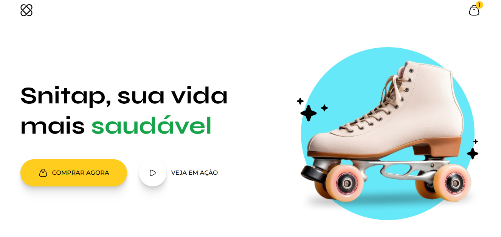

# PROJETO: ANIMAÇÃO PATINS

### Este projeto foi feito através das aulas da formação FullStack da Rocketseat, nela aprendi a criar animações suaves e satisfatórias para quem visualizar, foi utilizado apenas HTML e CSS.

## HABILIDADES UTILIZADA

- HTML
- CSS

#### Imagem do projeto

